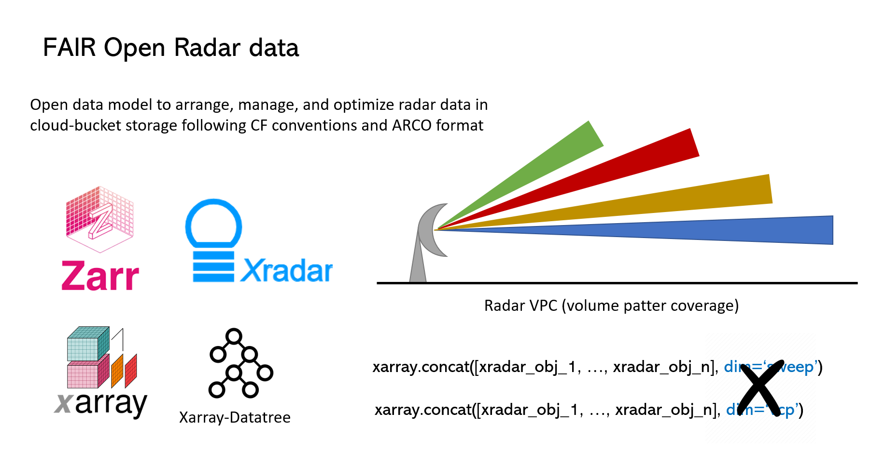

# FAIR open radar data
[](https://zenodo.org/doi/10.5281/zenodo.10069535)

## Motivation

Radars are vital in meteorology, detecting severe weather early and enabling timely warnings, saving lives,
and reducing property damage. Beyond forecasting, radar data supports various applications,
including for statistical analysis and climatology, relying on time series analysis. Radar scans generate large,
separated files, leading to vast accumulations over decades, posing storage challenges akin to big data management.
A radar volume scan, comprising data collected through multiple cone-like sweeps at various elevation angles,
often exceeds several megabytes in size every 5 to 10 minutes that usually stored as individual files.
Consequently, national weather radar networks accumulate vast amounts of data with non-interconnected files over
extended periods, spanning several decades. This presents significant challenges in data storage and availability,
particularly when treating radar data as a time-series dataset, which parallels the complexities of managing big data.

Traditionally, radar data storage involves proprietary formats that demand extensive input-output (I/O) operations,
leading to prolonged computation times and high hardware requirements. In response, our study introduces a novel d
ata model designed to address these challenges. Leveraging the Climate and Forecast (CF) format-based
[FM301](https://community.wmo.int/en/activity-areas/wis/wmo-cf-extensions) hierarchical tree structure,
endorsed by the World Meteorological Organization (WMO), and Analysis-Ready Cloud-Optimized
(ARCO; Abernathey et al. 2023) formats, we developed an open data model to arrange, manage, and store radar data in
cloud-storage buckets efficiently. This approach uses a suite of Python libraries, including Xarray (Xarray-Datatree),
Xradar, Wradlib, and Zarr, to implement a `hierarchical` `tree-like` data model. This model is designed to align
with the new open data paradigm, emphasizing the FAIR principles (Findable, Accessible, Interoperable, Reusable).


## Authors

[Alfonso Ladino-Rincon](https://github.com/aladinor),
[Max Grover](https://github.com/mgrover1)

### Collaborators

<a href="https://github.com/aladinor/raw2zarr/graphs/contributors">
  
</a>

### Running on Your Own Machine
If you are interested in running this material locally on your computer, you will need to follow this workflow:

1. Clone the ["raw2zarr"](https://github.com/aladinor/raw2zarr) repository
    ```bash
    git clone https://github.com/aladinor/raw2zarr.git
    ```

2. Move into the `raw2zarr` directory
    ```bash
    cd raw2zarr
    ```

3. Create and activate your conda environment from the `environment.yml` file
    ```bash
    conda env create -f environment.yml
    conda activate raw2zarr
    ```

4.  Move into the `notebooks` directory and start up Jupyterlab
    ```bash
    cd notebooks/
    jupyter lab
    ```

## Referencias
* R. P. Abernathey et al., "Cloud-Native Repositories for Big Scientific Data," in Computing in Science & Engineering, vol. 23, no. 2, pp. 26-35, 1 March-April 2021, doi: 10.1109/MCSE.2021.3059437.
