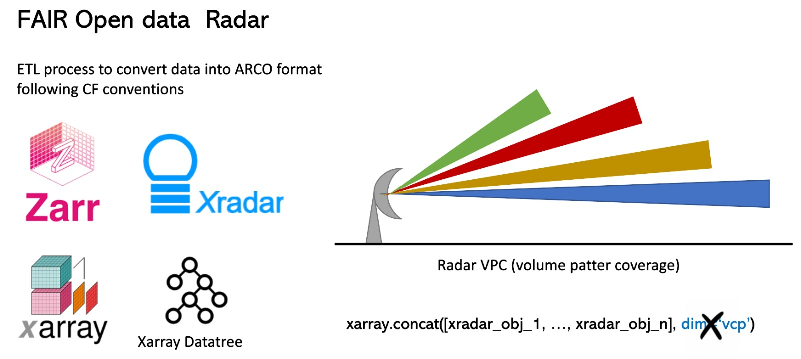

# FAIR open radar data

## Motivación
La información proveniente de los radares meteorológicos, muchas veces en su formato nativo, no permite acceder
a los datos usando el paradigma FAIR -**F**acil de encontrar, **A**ccequible / **A**sequible, **I**nteroperable y
**R**eusable-. Por lo tanto, hemos creado una posible solución que nos permite disponer los datos de los radares meteorológicos
en formato ARCO (**A**nalysis-**R**eady **C**loud-**Optimized**; Abernathey et al. 2023). Para llevar a acabo esto, proponemos una estructura basada en un `filesystem-like` que permite almacenar
en diferentes nodos cada elevación del radar usando `Xarray`, `Xradar` y `Datatree` y generar series de tiempo.

## Autores

[Alfonso Ladino-Rincon](https://github.com/aladinor),
[Max Grover](https://github.com/mgrover1)

### Colaboradores

## Referencias
* R. P. Abernathey et al., "Cloud-Native Repositories for Big Scientific Data," in Computing in Science & Engineering, vol. 23, no. 2, pp. 26-35, 1 March-April 2021, doi: 10.1109/MCSE.2021.3059437.
